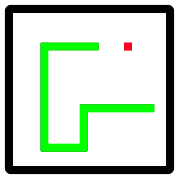

<!--
author:   Anton Kalch, Alexander Felber, Tristan Kaestner

email:    anton.kalch@gmail.com

version:  0.0.1

language: en

comment:  english LED-box presentation
-->

[](https://liascript.github.io/course/?https://raw.githubusercontent.com/ANEXL/english-presentation/main/presentation_template.md)

# Table of contents

1. Object of desire
2. Added value from this presentation
3. Scope of the presentation
4. Inspiration
5. Background Info / Technical Details
6. Code

 * Big picture
  
 * Important code snippets

7. Coding process

 * How did you code? Vibe? GitHub?
    
 * What did you already know (and from where do you know it) and what did you have to learn to complete the project?

8. The show/game. Demo and description
9. Conclusion. What did we get from taking part in this challenge?
10. Final thought/take-home message

## 1. Object of desire

<p align="center">
  
</p>

## 2. Added value from this presentation

 * basic python knowledge
    
 * how to work with libraries
    
 * insights into game logic and design

## 3. Scope of the presentation?

 * brief snake history
    
 * explaining our code and the thoughts behind it
    
 * the problems we had along the way

## 4. Inspiration?

 * initial tetris idea was abandoned (after concerns from Bjoern
    
 * inspiration from [onlinespiele-sammlung.de](onlinespiele-sammlung.de)

## 5. Background Info / Technical Details?

 * basic programming knowledge
    
 * ability to read (optional)

## 6. Code

                              {{1-2}}
*******************************************************************************

```python
from ulib import remote, display
import time
import random

# --- Spielkonstanten ---
MATRIX_WIDTH = 16
MATRIX_HEIGHT = 16
GAME_SPEED = 0.2  # Sekunden pro Frame (kleiner = schneller)

# Farben (R, G, B)
COLOR_SNAKE = (0, 20, 0)   # Grün
COLOR_FOOD = (20, 0, 0)    # Rot
COLOR_EMPTY = (0, 0, 0)     # Schwarz (Pixel aus)
COLOR_GAME_OVER = (10, 0, 0) # dunkelrot für Game Over
COLOR_Q = (255, 255, 255) # Weiss für Q auf dem Titelbildschirm

# --- Globale Spielvariablen ---
snake = [] # Liste der (x,y) Segmente der Schlange
snake_direction = (1, 0) # Aktuelle Bewegungsrichtung (dx, dy), Standard: rechts
food_position = None     # (x,y) Position des Apfels
game_over = False        # Spielstatus
score = 0                # Spielstand (wird nicht angezeigt, aber intern gezählt)
last_input_direction = None # Speichert die letzte empfangene Richtung von PC
start = False # Flag, ob das Spiel gestartet wurde

# --- Initialisierung des Spiels ---
def initialize_game():
    global snake, snake_direction, food_position, game_over, score
    snake = [(MATRIX_WIDTH // 2, MATRIX_HEIGHT // 2)] # Start in der Mitte
    snake_direction = (1, 0) # Startet nach rechts
    food_position = None
    game_over = False
    score = 0
    place_food() # Ersten Apfel platzieren
    title_screen() # Titelbildschirm anzeigen
    
def title_screen():
    """Zeigt den Titelbildschirm an."""
    #PUSH Q
    display.clear() # Matrix leeren
    display.set_xy((3, 2), COLOR_FOOD)
    display.set_xy((3, 3), COLOR_FOOD)
    display.set_xy((4, 2), COLOR_FOOD)
    display.set_xy((5, 3), COLOR_FOOD)
    display.set_xy((5, 4), COLOR_FOOD)
    display.set_xy((4, 5), COLOR_FOOD)
    display.set_xy((3, 5), COLOR_FOOD)
    display.set_xy((3, 4), COLOR_FOOD)
    display.set_xy((3, 6), COLOR_FOOD)
    display.set_xy((3, 7), COLOR_FOOD)
    display.set_xy((3, 8), COLOR_FOOD)

    display.set_xy((6, 2), COLOR_SNAKE)
    display.set_xy((6, 3), COLOR_SNAKE)
    display.set_xy((6, 4), COLOR_SNAKE)
    display.set_xy((6, 5), COLOR_SNAKE)
    display.set_xy((6, 6), COLOR_SNAKE)
    display.set_xy((6, 7), COLOR_SNAKE)
    display.set_xy((6, 8), COLOR_SNAKE)
    display.set_xy((7, 8), COLOR_SNAKE)
    display.set_xy((8, 8), COLOR_SNAKE)
    display.set_xy((8, 7), COLOR_SNAKE)
    display.set_xy((8, 6), COLOR_SNAKE)
    display.set_xy((8, 5), COLOR_SNAKE)
    display.set_xy((8, 4), COLOR_SNAKE)
    display.set_xy((8, 3), COLOR_SNAKE)
    display.set_xy((8, 2), COLOR_SNAKE)

    display.set_xy((9, 2), COLOR_FOOD)
    display.set_xy((9, 3), COLOR_FOOD)
    display.set_xy((9, 4), COLOR_FOOD)
    display.set_xy((9, 5), COLOR_FOOD)
    display.set_xy((10, 5), COLOR_FOOD)
    display.set_xy((11, 5), COLOR_FOOD)
    display.set_xy((11, 6), COLOR_FOOD)
    display.set_xy((11, 7), COLOR_FOOD)
    display.set_xy((11, 8), COLOR_FOOD)
    display.set_xy((10, 8), COLOR_FOOD)
    display.set_xy((9, 8), COLOR_FOOD)
    display.set_xy((10, 2), COLOR_FOOD)
    display.set_xy((10, 3), COLOR_FOOD)

    display.set_xy((12, 2), COLOR_SNAKE)
    display.set_xy((12, 3), COLOR_SNAKE)
    display.set_xy((12, 4), COLOR_SNAKE)
    display.set_xy((12, 5), COLOR_SNAKE)
    display.set_xy((12, 6), COLOR_SNAKE)
    display.set_xy((12, 7), COLOR_SNAKE)
    display.set_xy((12, 8), COLOR_SNAKE)
    display.set_xy((13, 5), COLOR_SNAKE)
    display.set_xy((14, 2), COLOR_SNAKE)
    display.set_xy((14, 3), COLOR_SNAKE)
    display.set_xy((14, 4), COLOR_SNAKE)
    display.set_xy((14, 5), COLOR_SNAKE)
    display.set_xy((14, 6), COLOR_SNAKE)
    display.set_xy((14, 7), COLOR_SNAKE)
    display.set_xy((14, 8), COLOR_SNAKE)

    display.set_xy((6, 11), COLOR_Q)
    display.set_xy((6, 12), COLOR_Q)
    display.set_xy((6, 13), COLOR_Q)
    display.set_xy((6, 14), COLOR_Q)
    display.set_xy((7, 15), COLOR_Q)
    display.set_xy((8, 15), COLOR_Q)
    display.set_xy((9, 15), COLOR_Q)
    display.set_xy((9, 13), COLOR_Q)
    display.set_xy((10, 14), COLOR_Q)
    display.set_xy((11, 15), COLOR_Q)
    display.set_xy((11, 13), COLOR_Q)
    display.set_xy((11, 12), COLOR_Q)
    display.set_xy((11, 11), COLOR_Q)
    display.set_xy((11, 10), COLOR_Q)
    display.set_xy((10, 10), COLOR_Q)
    display.set_xy((9, 10), COLOR_Q)
    display.set_xy((8, 10), COLOR_Q)
    display.set_xy((7, 10), COLOR_Q)

    display.show() # Matrix aktualisieren
    time.sleep(2) # Kurze Pause für den Titelbildschirm

def place_food():
    """Platziert den Apfel an einer zufälligen, freien Stelle."""
    global food_position
    while True:
        x = random.randint(0, MATRIX_WIDTH - 1)
        y = random.randint(0, MATRIX_HEIGHT - 1)
        if (x, y) not in snake: # Stelle darf nicht von Schlange belegt sein
            food_position = (x, y)
            break

def draw_game_state():
    """Zeichnet den aktuellen Spielzustand auf die LED-Matrix."""
    # Zuerst alles leeren
    for x_clear in range(MATRIX_WIDTH):
        for y_clear in range(MATRIX_HEIGHT):
            display.set_xy((x_clear, y_clear), COLOR_EMPTY)

    # Schlange zeichnen
    for segment in snake:
        display.set_xy(segment, COLOR_SNAKE)

    # Apfel zeichnen
    if food_position:
        display.set_xy(food_position, COLOR_FOOD)

    display.show() # Matrix aktualisieren

def update_game_logic():
    """Aktualisiert die Spiellogik für einen Frame."""
    global snake, snake_direction, food_position, game_over, score, last_input_direction

    if game_over:
        return

    # Richtung basierend auf letzter Tasteneingabe anpassen
    # Verhindert sofortiges 180-Grad-Drehen in sich selbst
    if last_input_direction == "W" and snake_direction != (0, 1):
        snake_direction = (0, -1) # Hoch
    elif last_input_direction == "S" and snake_direction != (0, -1):
        snake_direction = (0, 1)  # Runter
    elif last_input_direction == "A" and snake_direction != (1, 0):
        snake_direction = (-1, 0) # Links
    elif last_input_direction == "D" and snake_direction != (-1, 0):
        snake_direction = (1, 0)  # Rechts
    last_input_direction = None # Eingabe verarbeitet

    # Nächste Kopfposition berechnen
    head_x, head_y = snake[0]
    next_head_x = head_x + snake_direction[0]
    next_head_y = head_y + snake_direction[1]
    next_head = (next_head_x, next_head_y)

    # Kollisionserkennung
    # 1. Mit Wänden
    if not (0 <= next_head_x < MATRIX_WIDTH and 0 <= next_head_y < MATRIX_HEIGHT):
        game_over = True
        return
    # 2. Mit sich selbst (außer dem letzten Segment, falls der Apfel gefressen wird)
    if next_head in snake and next_head != snake[-1]:
        game_over = True
        return

    # Schlange bewegen: Neuen Kopf hinzufügen
    snake.insert(0, next_head)

    # Apfel gegessen?
    if next_head == food_position:
        score += 1
        place_food() # Neuen Apfel platzieren
    else:
        snake.pop() # Letztes Segment entfernen (Schlange bewegt sich)

# --- Remote-Steuerfunktionen (werden von ulib aufgerufen) ---
# Diese Funktionen setzen nur die gewünschte Richtung
def remote_left(c):
    global last_input_direction
    last_input_direction = "A"

def remote_right(c):
    global last_input_direction
    last_input_direction = "D"

def remote_up(c):
    global last_input_direction
    last_input_direction = "W"

def remote_down(c):
    global last_input_direction
    last_input_direction = "S"

def remote_start(c):
    global start
    start = True

# --- Tastenbindungen und Listener starten ---
# Der 'print' Befehl für bind_all wurde entfernt.
remote.bind_key("A", remote_left)
remote.bind_key("D", remote_right)
remote.bind_key("W", remote_up)
remote.bind_key("S", remote_down)
remote.bind_key("LEFT", remote_left)
remote.bind_key("RIGHT", remote_right)
remote.bind_key("UP", remote_up)
remote.bind_key("DOWN", remote_down)
remote.bind_key("Q", remote_start) # Startet das Spiel
remote.listen() # Startet den UDP-Server, der auf deinen PC-Eingaben horcht

# --- Hauptspielschleife ---
if __name__ == "__main__":
    initialize_game() # Spiel beim Start initialisieren

    while not start:
        
        time.sleep(0.1)

    while True:
        if not game_over:
            update_game_logic() # Spiellogik aktualisieren
            draw_game_state()   # Spiel auf Matrix zeichnen
            time.sleep(GAME_SPEED) # Wartezeit für Spielgeschwindigkeit
        else:
            # Spielende-Anzeige (blinkendes Game Over)
            for x_go in range(MATRIX_WIDTH):
                for y_go in range(MATRIX_HEIGHT):
                    display.set_xy((x_go, y_go), COLOR_GAME_OVER if int(time.time() * 2) % 2 == 0 else COLOR_EMPTY)
            display.show()
            time.sleep(0.5) # Langsamer blinken
            # Das Skript muss nach einem Game Over manuell neu gestartet werden,
            # um ein neues Spiel zu beginnen.
```
*******************************************************************************

                              {{2-3}}
*******************************************************************************
```python
def initialize_game():
    global snake, snake_direction, food_position, game_over, score
    snake = [(MATRIX_WIDTH // 2, MATRIX_HEIGHT // 2)] # Start in der Mitte
    snake_direction = (1, 0) # Startet nach rechts
    food_position = None
    game_over = False
    score = 0
    place_food() # Ersten Apfel platzieren
    title_screen() # Titelbildschirm anzeigen
```
*******************************************************************************

                              {{3-4}}
*******************************************************************************
```python
def place_food():
    """Platziert den Apfel an einer zufälligen, freien Stelle."""
    global food_position
    while True:
        x = random.randint(0, MATRIX_WIDTH - 1)
        y = random.randint(0, MATRIX_HEIGHT - 1)
        if (x, y) not in snake: # Stelle darf nicht von Schlange belegt sein
            food_position = (x, y)
            break
```
*******************************************************************************

                              {{4-5}}
*******************************************************************************
```python
def draw_game_state():
    """Zeichnet den aktuellen Spielzustand auf die LED-Matrix."""
    # Zuerst alles leeren
    for x_clear in range(MATRIX_WIDTH):
        for y_clear in range(MATRIX_HEIGHT):
            display.set_xy((x_clear, y_clear), COLOR_EMPTY)

    # Schlange zeichnen
    for segment in snake:
        display.set_xy(segment, COLOR_SNAKE)

    # Apfel zeichnen
    if food_position:
        display.set_xy(food_position, COLOR_FOOD)

    display.show() # Matrix aktualisieren
```
*******************************************************************************

                              {{5-6}}
*******************************************************************************
```python
def update_game_logic():
    """Aktualisiert die Spiellogik für einen Frame."""
    global snake, snake_direction, food_position, game_over, score, last_input_direction

    if game_over:
        return

    # Richtung basierend auf letzter Tasteneingabe anpassen
    # Verhindert sofortiges 180-Grad-Drehen in sich selbst
    if last_input_direction == "W" and snake_direction != (0, 1):
        snake_direction = (0, -1) # Hoch
    elif last_input_direction == "S" and snake_direction != (0, -1):
        snake_direction = (0, 1)  # Runter
    elif last_input_direction == "A" and snake_direction != (1, 0):
        snake_direction = (-1, 0) # Links
    elif last_input_direction == "D" and snake_direction != (-1, 0):
        snake_direction = (1, 0)  # Rechts
    last_input_direction = None # Eingabe verarbeitet

    # Nächste Kopfposition berechnen
    head_x, head_y = snake[0]
    next_head_x = head_x + snake_direction[0]
    next_head_y = head_y + snake_direction[1]
    next_head = (next_head_x, next_head_y)

    # Kollisionserkennung
    # 1. Mit Wänden
    if not (0 <= next_head_x < MATRIX_WIDTH and 0 <= next_head_y < MATRIX_HEIGHT):
        game_over = True
        return
    # 2. Mit sich selbst (außer dem letzten Segment, falls der Apfel gefressen wird)
    if next_head in snake and next_head != snake[-1]:
        game_over = True
        return

    # Schlange bewegen: Neuen Kopf hinzufügen
    snake.insert(0, next_head)

    # Apfel gegessen?
    if next_head == food_position:
        score += 1
        place_food() # Neuen Apfel platzieren
    else:
        snake.pop() # Letztes Segment entfernen (Schlange bewegt sich)
```
*******************************************************************************

                              {{6-7}}
*******************************************************************************
```python
if __name__ == "__main__":
    initialize_game() # Spiel beim Start initialisieren

    while not start:
        
        time.sleep(0.1)

    while True:
        if not game_over:
            update_game_logic() # Spiellogik aktualisieren
            draw_game_state()   # Spiel auf Matrix zeichnen
            time.sleep(GAME_SPEED) # Wartezeit für Spielgeschwindigkeit
        else:
            # Spielende-Anzeige (blinkendes Game Over)
            for x_go in range(MATRIX_WIDTH):
                for y_go in range(MATRIX_HEIGHT):
                    display.set_xy((x_go, y_go), COLOR_GAME_OVER if int(time.time() * 2) % 2 == 0 else COLOR_EMPTY)
            display.show()
            time.sleep(0.5) # Langsamer blinken
            # Das Skript muss nach einem Game Over manuell neu gestartet werden,
            # um ein neues Spiel zu beginnen.
```
*******************************************************************************

## 7. Coding process
  1. Prototype in C#
  2. First Python prototype with pygame library
  3. Final solution with our own functions


                                {{1-2}}
*******************************************************************************
  1. Prototype in C#
  ```C#
  class Program
  {
    static void Main(string[] args)
    {
        Level myLevel = new Level(); // Level construction
        Player myPlayer = new Player(); // Player construction

        Thread thd1 = new Thread(new ThreadStart(Loop1));//Zwei parallele methoden initilaisieren
        Thread thd2 = new Thread(new ThreadStart(Loop2));
        Thread thd3 = new Thread(new ThreadStart(Loop3));

        thd1.Start(); thd2.Start(); thd3.Start();
        thd1.Join(); thd2.Join(); thd3.Join();

        void Loop1()
        {
            myLevel.RefreshArea(myPlayer.headpos[0], myPlayer.headpos[1], myPlayer.tailpos, myPlayer.length);
            //int s = 0;
            while (true)
            {
                myPlayer.MoveTail();

                switch (myPlayer.headdir)
                {
                    case 'd': myPlayer.headpos[1]++; break;
                    case 'u': myPlayer.headpos[1]--; break;
                    case 'l': myPlayer.headpos[0]--; break;
                    case 'r': myPlayer.headpos[0]++; break;
                }

                    myPlayer.CollDet(myLevel.Area);
               
                myLevel.RefreshArea(myPlayer.headpos[0], myPlayer.headpos[1], myPlayer.tailpos, myPlayer.length);

                Console.Clear();
                myLevel.PrintArea(myLevel.Area);
                System.Threading.Thread.Sleep(250);
            }
        }

        void Loop2()
        {
            while (true)
            {
                switch (Console.ReadKey(true).Key)//checkt tatstatur input
                {
                    case ConsoleKey.UpArrow: myPlayer.headdir = 'u'; break;  //pfeiltatsen setzen richtung
                    case ConsoleKey.DownArrow: myPlayer.headdir = 'd'; break;
                    case ConsoleKey.LeftArrow: myPlayer.headdir = 'l'; break;
                    case ConsoleKey.RightArrow: myPlayer.headdir = 'r'; break;
                    case ConsoleKey.Escape: Environment.Exit(0); break;
                }
            }
        }
        
        void Loop3()
        {
            while (true)
            {
                System.Threading.Thread.Sleep(1000);
                myPlayer.length++;
            }
        }
        
    }
  }
  ```
*******************************************************************************

                                {{2-3}}
*******************************************************************************
  2. First Python prototype with pygame library
  ```python
  def main():
    global richtung
    pygame.init()
    screen = pygame.display.set_mode((SCREEN_WIDTH, SCREEN_HEIGHT))
    pygame.display.set_caption("Snake")
    clock = pygame.time.Clock()

    snake_position = [(5, 5), (4, 5), (3, 5)]
    richtung = (1, 0)
    apple_position = äpfel_generieren(snake_position, (GRID_WIDTH, GRID_HEIGHT))
    running = True

    while running:
        for event in pygame.event.get():
            if event.type == pygame.QUIT:
                running = False
            richtung = steuerung_schlange(event, richtung)

        # Bewegung
        new_head = (snake_position[0][0] + richtung[0], snake_position[0][1] + richtung[1])
        snake_position.insert(0, new_head)

        # Apfel gegessen?
        if new_head == apple_position:
            apple_position = äpfel_generieren(snake_position, (GRID_WIDTH, GRID_HEIGHT))
        else:
            snake_position.pop()

        if kollision_pruefung(snake_position, (GRID_WIDTH, GRID_HEIGHT)):
            running = False

        # Zeichnen mit pygame
        screen.fill((0, 0, 0))
        zeichne_schlange(screen, snake_position)
        zeichne_apfel(screen, apple_position)
        pygame.display.flip()
        clock.tick(10)

        # Zeichnen auf der LED-Matrix
        display.fill((0, 0, 0))
        for segment in snake_position:
            display.set_xy(segment[0], segment[1], (0, 255, 0)) 
        display.set_xy(apple_position, (255, 0, 0))
        display.show()

    pygame.quit()
  ```
*******************************************************************************

## 8. The show/game. Demo and description

<p align="center">
  
</p>

## 9. Conclusion. What did we get from taking part in this challenge?

 * training to work as a team
   
 * new Python skills
   
 * learned to work with inputs from remote controllers
   
## 10. Final thought/take-home message

 * It's easier than it looks

 
